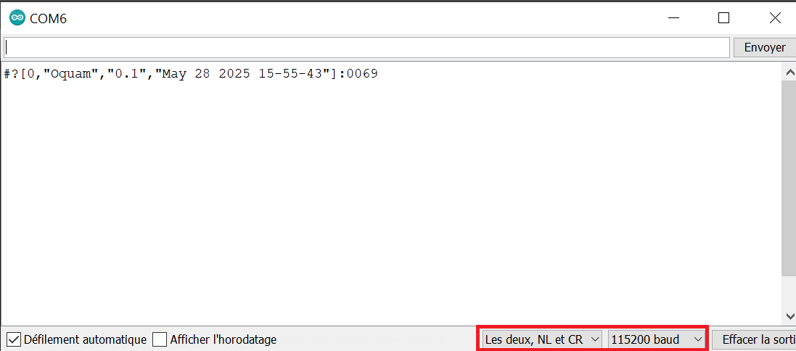
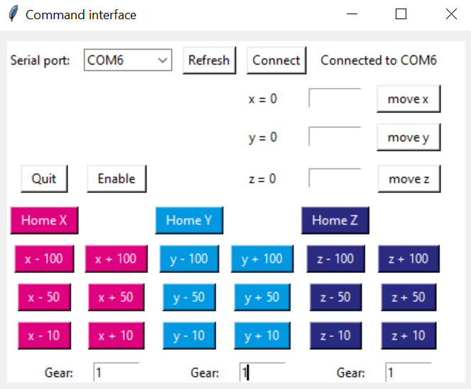

# ControlStage

[](https://www.python.org/downloads/)
[](LICENSE)
[](https://zenodo.org)
[](https://github.com/Alienor134/UC2_Fluorescence_microscope)
[](https://www.arduino.cc/)

---

## Module Information

**Intended Audience**: Researchers, engineers, and makers working on laboratory automation, microscopy, robotics, or hardware-software interfacing. This module is designed for users who need robust serial communication between Python and Arduino for instrument control, data acquisition, or interactive hardware systems.

**Related Modules**:
- [ControlCamera](../ControlCamera/) - Camera acquisition interface
- [ControlLight](../ControlLight/) - LED and laser control
- [ControlSerial](../ControlSerial/) - Python serial interface
- [Main Project Documentation](https://alienor134.github.io/UC2_Fluorescence_microscope/docs/) - Complete microscope setup

---

__keywords__: Stepper motors, Arduino, Python, Freecad, 3D printing

The goal of this module is to provide simple tools to control a motor to automate manual tasks.

An Arduino is used to control the stepper motors with motor shields. The motors are controllable: 
- via Arduino through the serial interface
- with a Python library that communicates serially with the Arduino
- with a user-friendly Tkinter interface based on the Python library
  
The use of limit-switches is integrated and is preferred for safety and reproducibility. 


## Pre-requisites

- Install [ControlSerial](https://github.com/SonyCSLParis/CSL-Serial) and the [Arduino software](https://www.arduino.cc/en/software)
- The stepper motor(s) and motor shield(s) are readily available. Refer to the example gallery for ideas. 
- The code was tested on Windows and Linux


## Hardware :gear:
Check-out the example gallery and the description of how to implement them: turning a manual stage in a motorized one, building a microscope focus module, increasing the displacement range of a piezo-motor, etc. 

| Component|      Quantity      |  Price per unit | Example|  
|----------|:-------------:|------:|------:|  
| Arduino Uno |    1   |   24€ | [Robotshop](https://www.robotshop.com/eu/fr/microcontroleur-arduino-uno-r3-usb.html)|  
|Stepper motor | tested up to 3 | |
| Stepper driver | | |
| Wires | | |


## Software :desktop_computer:

| Software | Version we used | Download |
|----------|:-------------:|:-------------:|  
| Arduino | 1.8.13 | [download](https://www.arduino.cc/en/software)
| Python  | 3.7 |[install](https://github.com/Alienor134/Teaching/blob/master/Python/Installing_Anaconda_creating_environment.md)
| Controlserial | 1.0 | [install](XXX)


## Codes and files provided :chart_with_upwards_trend:

An [Arduino code](Oquam/Oquam.ino) is provided to control the motors. An extra layer is added in Python to conntrol it easily.
[ControlStage](ControlMotors/ControlStage.py) is a class that can be used the following way:


```python
from serial import Serial
from ControlMotors import ControlStage

arduino_port = "COM6"

stage = ControlStage(arduino_port, [1,1,1]) #gearbox ratio of X, Y and Z axis
stage.handle_enable(1)
stage.move_dx(10)
stage.handle_enable(0)
stage.close() 
```


# Instructions

## Connect the Arduino, the stepper driver and the stepper motor
Refer to the documentation of the motor shield/stepper driver you selected to perform the wiring and understand the meaning of the STEP, DIR, ENABLE and limit‑switch pins. For example: [EasyDrive stepper motor driver](https://www.instructables.com/How-to-Interface-Easy-Driver-With-Stepper-Motor-Us/), [XY-motorized stage wiring](https://github.com/SonyCSLParis/Motorized-stage/tree/main/XY-stage), 

## Arduino and Python codes  

First install Arduino IDE and Python 3.7 (links in the **Software** section)  
Second download this repository. We will call the address where you save it "path/to/repo" (for example "C://User/Me/MyRepos").

Before uploading the firmware, make sure that your wiring (STEP, DIR, ENABLE pins for each axis and limit switches) matches the pin definitions in [Oquam/gshield.h](Oquam/gshield.h). If you change the wiring, you must update gshield.h accordingly so that the firmware drives the correct pins.

Open the [Oquam/Oquam.ino](Oquam/Oquam.ino) file. 
Open it with Arduino IDE software by double clicking on the file **Oquam.ino** and upload the codes on the Arduino by clicking on the arrow. If it fails make sure that you are correctly connected to the Arduino: check the card type and the COM port in the "Tools" ("Outils" on the image). 

<p align="center">

</p>

### Test basic Oquam commands from the Arduino Serial Monitor

You can talk directly to the Oquam firmware from the Arduino IDE Serial Monitor using the RomiSerial protocol. Set the Serial Monitor to **115200 baud** and **"Both NL & CR"**, then type commands of the form:

```text
#<opcode>[args...]:xxxx
```


Some useful examples:

- Identify the controller (should return a string containing "Oquam"):

	```text
	#?:xxxx
	```

<p align="center">

</p>


- Check whether the stage is idle or running:

	```text
	#I:xxxx
	```

- Enable / disable the motor drivers (1 = enable, 0 = disable):

	```text
	#E[1]:xxxx    ; enable motors
	#E[0]:xxxx    ; disable motors
	```

- Read the current stepper positions (returns `[0,x,y,z]`):

	```text
	#P:xxxx
	```

- Configure homing order (X, Y, Z axis indices: 0,1,2; use -1 to skip an axis) and start homing:

	```text
	#h[0,-1,-1]:xxxx   ; home X only
	#H:xxxx            ; start homing sequence
	```

- Queue a relative move with duration `dt` and displacements `dx,dy,dz` in motor steps:

	```text
	#M[2000,1000,0,0]:xxxx   ; move X by +1000 steps over dt=2000
	```

If a command is accepted you will see a response starting with `#0,` (OK). Errors are returned with non‑zero codes and a short message.


To make the interaction user-friendly, we developed a code that sends instructions to the Arduino through the Serial port. It requires Python. If you already use Python for other projects, you will want to keep this code isolated from your current install. This is possible with a virtual environment. Open Anaconda Prompt and navigate to the repository.

### Option 1 – Run the Python package

```
cd ControlMotors
pip install -e .
```

You can launch the interface 

```
from ControlMotors import ControlStage
from ControlMotors import interface_motors

stage = ControlStage("COM6", [1,1,1])
interface_motors(stage)
```
Press the buttons to move by predefined values, or enter manually a value and press the "move" button. The values correspond to logical stage steps, which are converted to motor steps internally using the gear ratios you provide.


<p align="center">

</p>

### Option 2 – Use a standalone executable (Windows)

If you do not want to install Python, you can use a pre‑built Windows executable of the Tk interface.

**Pre‑requisites:**
- Arduino flashed with the Oquam firmware from [Oquam/Oquam.ino](Oquam/Oquam.ino).
- The ports described in [Oquam/gshield.h](Oquam/gshield.h) match the wiring of the motor shield and the Arduino.
- The Arduino is connected and appears on a COM port (e.g. COM6).
- The correct gear ratios for X, Y, Z are known.


**Download the executable:**

- Go to the ControlMotors GitHub Releases page.
- Download the latest `interface_motors.exe`.


If the automated port connection fails, check that the correct firmware is flashed on the Arduino, that the COM port is correct, and that no other program (e.g. Arduino IDE serial monitor) is using the same port. You can also test manually from the Serial monitor of Arduino IDE that sending 


Note: You will have to determine the backlash of each of your motors: the number of steps you have to turn before the platform moves when you change directions. You will find 4 backlash values, one per direction per motor. We found backlash values between 7 and 12 steps. 


## Hardware tests

The repository contains a small test suite to validate the stage control. By default only unit tests (no hardware) are run; hardware tests have to be started explicitly.

- To run unit tests only (safe on any machine):

	```bash
	cd ControlMotors
	python run_tests.py
	```

- To also run hardware tests (will move the stage):

	```bash
	cd ControlMotors
	python run_tests.py --with-hardware
	```

	Make sure the Arduino with Oquam is connected, the wiring matches Oquam/gshield.h, and the COM ports in the test files reflect your setup.

One useful interactive hardware script is `Tests/hardware/test_Z_motor.py`. When you run it with Python it will:

- Ask for the COM port, which axis/axes (X/Y/Z) to test, gear ratios, step size and homing timeout.
- Guide you through manual checks with motors disabled (you move the axis by hand) and enabled.
- Optionally perform programmed moves and homing at the end, while you visually confirm that the stage behaves as expected.

Always ensure the mechanics are safe to move before running hardware tests.


## Examples
### Photos


</img> 
</img> 
</img> </img> 

### How to reproduce: 

https://github.com/SonyCSLParis/Motorized-stage/tree/main/XY-stage  
https://github.com/SonyCSLParis/Motorized-stage/tree/main/Z-stage  
https://github.com/openUC2/UC2-Motorized-XY-Table  


## License

This project is licensed under the [GNU General Public License v3.0](https://tldrlegal.com/license/gnu-general-public-license-v3-(gpl-3))

